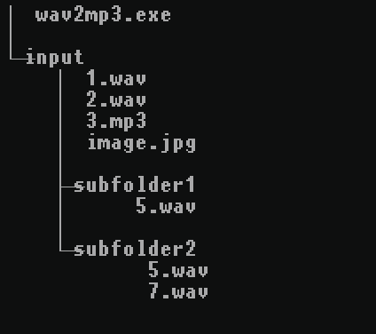
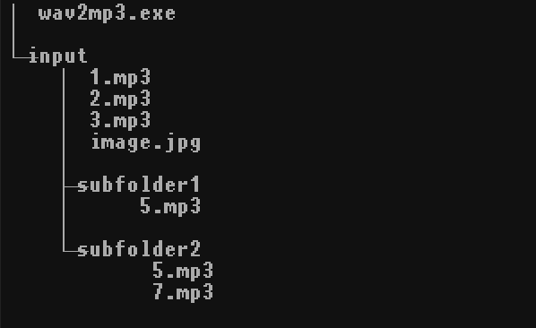

# wav2mp3
Convert wav to mp3  
generate mp3 from input folder and move wav to trash bin

# Result   
    
     

# Method
1. place wav folder into input folder   
2. run wav2mp3.exe   
3. it generate mp3 and move wav to trash bin   

# Required environment to run      
pip install pyinstaller    
pip install glob2  
pip install pydub   
pip install tqdm  
pip install Send2Trash  

# run python
python wav2mp3.py

# pyinstaller build  
pyinstaller --onefile --add-data="ffmpeg/*;ffmpeg/" wav2mp3.py

# Acknowledgement and References    
- [FFmpeg](https://github.com/BtbN/FFmpeg-Builds)      
- [pyinstaller](https://www.pyinstaller.org/)   
- [Send2Trash](https://pypi.org/project/Send2Trash/)   
- [pydub](https://pypi.org/project/pydub/)   

